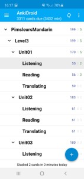
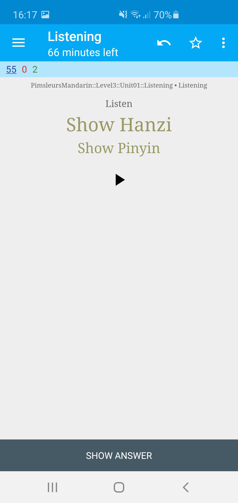
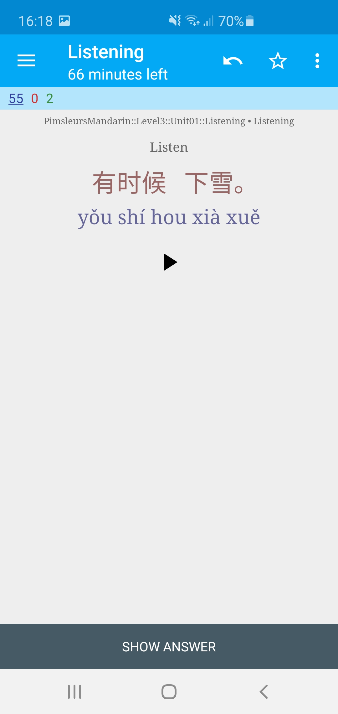
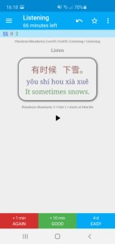
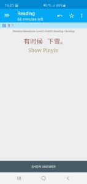
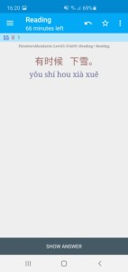
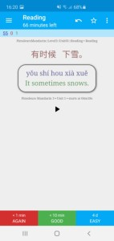
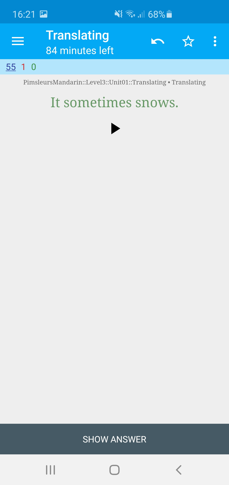
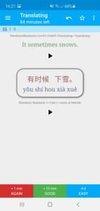

# Introduction

I transformed my transcripts of Pimsleurs Mandarin Chinese course to Anki Learning Cards and share them here:
https://ankiweb.net/shared/info/1055164593

As for now, there are only units 1 to 5 of a total of 30 units.
Since these high quality Anki Learning Cards seem to be much appreciated by many learners (it's actually Top 2 of [all Anki Mandarin decks](https://ankiweb.net/shared/decks/mandarin)), I want to make Anki Cards also for rest of the units.

I transcribed already units 6 to 10 but they need to be **reviewed and corrected** by anybody who is interested in this project. If it works out well, I'll add here the rest of the units (11 to 30).

# How you can help

For each unit there is a `anki.csv` file which contains the transcripts I've selected to make Anki Learning Cards eventually. The columns in the csv file are separated by tabs. You can import the csv files in any spreadsheet application such as Excel or Open Office Calc etc.

Once opened, the first three columns contain the transcripts that need to be reviewed and corrected.

## Example

For example, the first line of `P3/Unit06/anki.csv` look like this:

| A | B | C | D | E | F | G | H |
| --- | --- | --- | --- | --- | --- | --- | --- |
| What would you like to drink? | 您 想 喝 什么 | nín xiǎng hē shén me | [sound:PM3-U06-027.mp3] | [sound:PM3-U06-028.mp3] | 3 | 6 | 00m48s |
| I'd like to drink some wine | 我想 喝 一点 葡萄酒 | wǒ xiǎng hē yī diǎn pú tao jiǔ | [sound:PM3-U06-030.mp3] | [sound:PM3-U06-031_PM3-U06-032.mp3] | 3 | 6 | 01m06s |

As you can see in column B, the first chinese transcript is missing the question mark. 
In the same line in column C, the last word of the pinyin transcript is wrong: instead if `me` it should be `hē`. Furthermore, the question mark is missing too.

Your task would be to correct these errors. Once corrected, please do a pull request so I can merge your work into the master branch.

You may listen the soundfiles indicated in column D and E (English respective Chinese) to verify the transcripts. The soundfiles are located in the `mp3` folder where the `anki.csv` is located.

The last 3 columns (F, G, H) indicate the course level (in this example it's level 3), the unit (in this example it's unit 6) and the start of the conversation within the orginal Pimsleur Chinese Mandaran Course (in this example it starts at 00m48s).

# The Result

From the corrected `anki.csv` files I'll produce Anki Learning cards. They can be used everywhere where Anki can be installed. On my Android smartphone it looks like this:

As you can see, the course is structured into lessons and units as the original audio course.

I've made three types of learning cards:
1. Listening
2. Reading
3. Translating

The initial order of the learning cards reflects the order given by the original audio course. However, the order will change dependent on the given answers when studying learning cards.

Generally, only the first occurrence of a phrase or word within a learning unit has been transcribed. However, the same phrase or word may be repeated in another learning unit. 

## Listening Mode

In this mode you'll listen to the chinese audio and try to guess what it means. Click the play button to listen again.

Click "Show Hanzi" to reveal the chinese characters:

Click "Show Pinyin" to reveal the pinyin:

Click "Show Answer" to reveal the answer:

Below the answer you can see when the conversation starts in the original Pimsleur Chinese Mandarin Course, here it start's in Level 3, in Unit 1, at 4 minutes and 18 seconds.

## Reading Mode

In this mode you'll read chinese characters and try to guess what they mean. 

Click "Show Pinyin" to reveal the pinyin:

Click "Show Answer" to reveal the answer:

Below the answer you can see when the conversation starts in the original Pimsleur Chinese Mandarin Course, here it start's in Level 3, in Unit 1, at 4 minutes and 18 seconds.

## Translating Mode

In this mode you have to try translate an English sentence to Chinese. You may click the play button to listen again.

Click "Show Answer" to reveal the answer:

You may click the play button to listen again the chinese sentence.
Below the answer you can see when the conversation starts in the original Pimsleur Chinese Mandarin Course, here it start's in Level 3, in Unit 1, at 4 minutes and 18 seconds.
